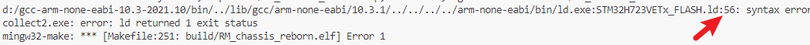
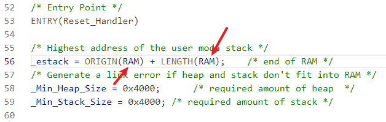
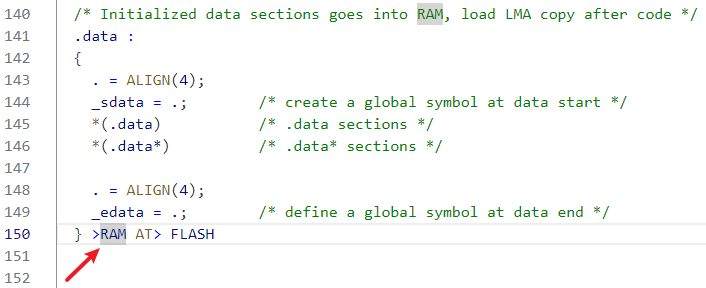
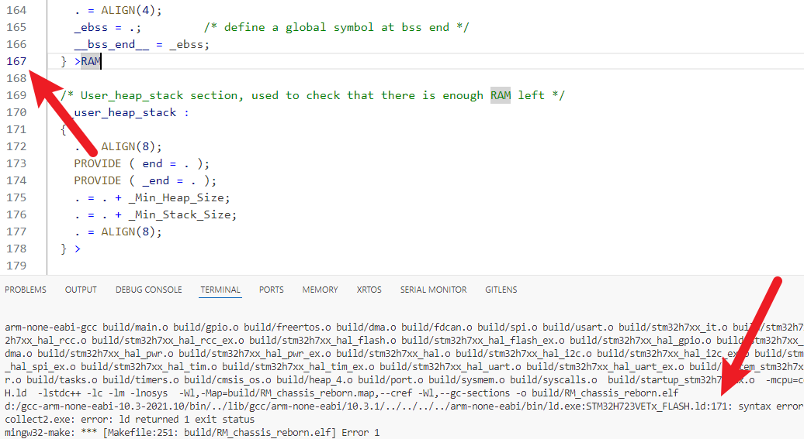
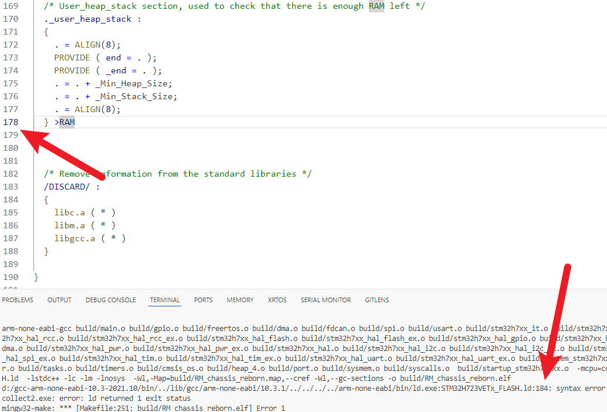
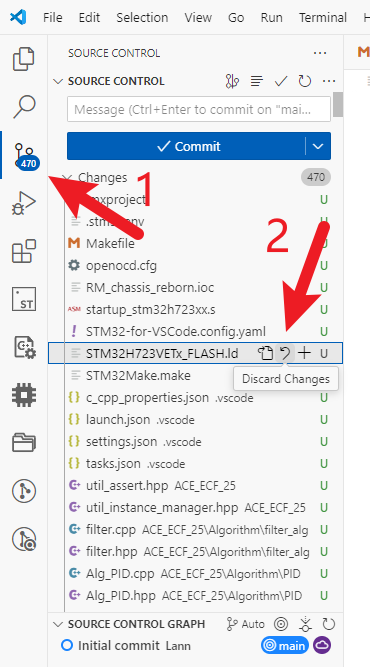

# 关于新版CubeMX生成的LD文件语法错误解决方法

## 解决方法

*问题背景 升级新版CubeMX后生成的LD文件语法有更改，导致编译不通过，解决方法如下*

***

根据报错可知大概在第几行有错，一般都是少了 **RAM** 这个词,以下贴出几个必出例子\

***
@attention *有时候报错的地方挺抽象的，不过一般都是在*    **>**    *后面补*    **RAM**    *关键词*

## CubeMX添加新功能重新生成后解决方法
**善用git上传代码至云端，更改后根据图片步骤一键回退单个文件即可**

